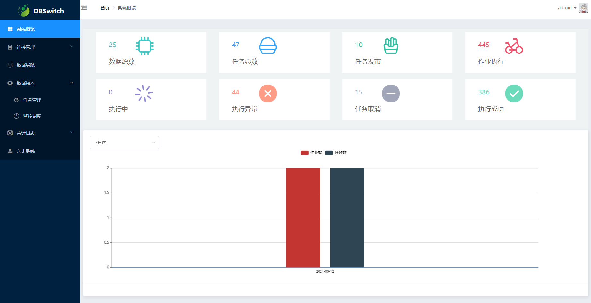
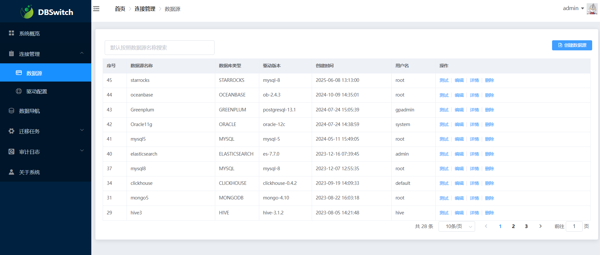
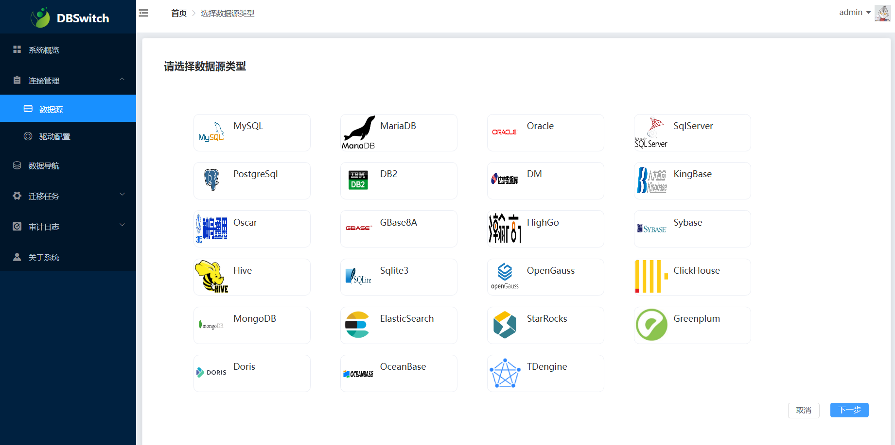
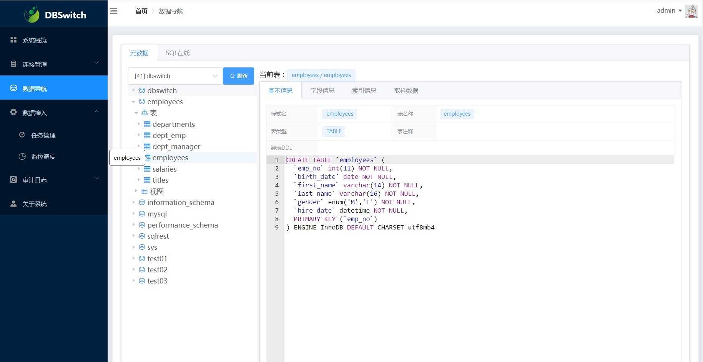
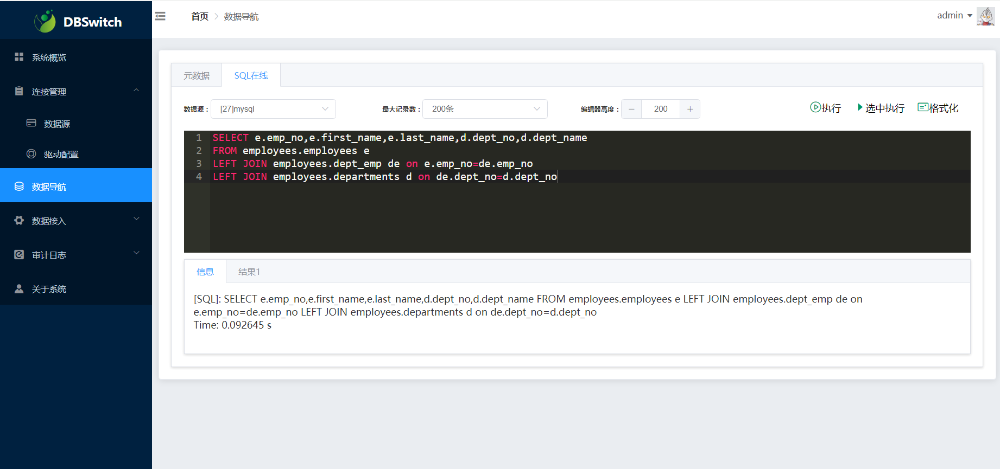
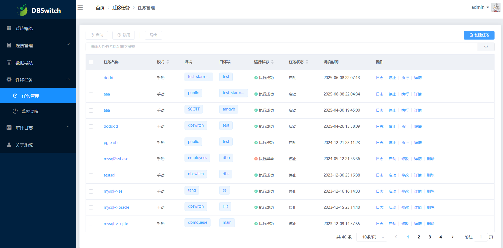
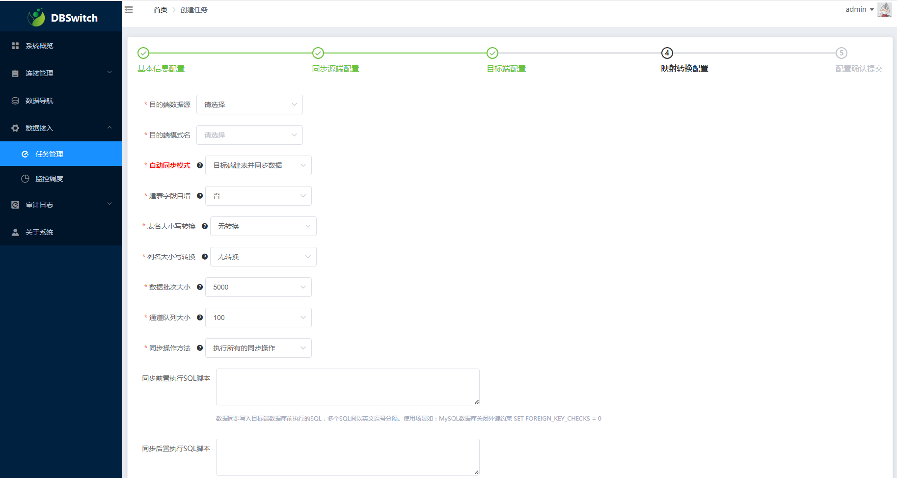
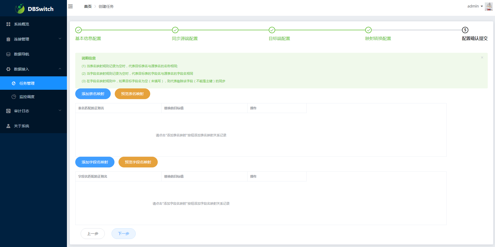
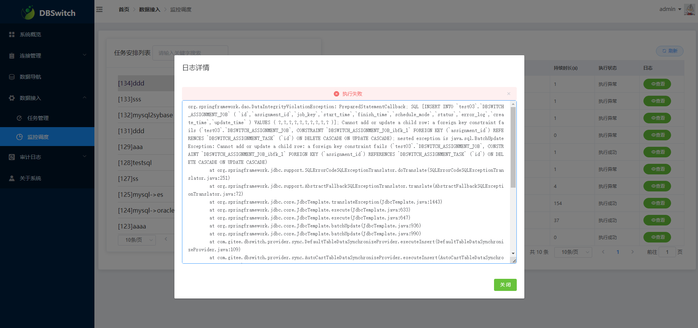

# 异构数据库数据与结构同步工具


## 一、工具介绍

### 1、功能描述

一句话，dbswitch工具提供源端数据库向目的端数据库的离线**批量**迁移同步功能，支持数据的全量/增量/变化量方式同步。包括：

- **结构迁移**

支持字段类型、主键信息、建表语句等的转换，并生成建表SQL语句。

支持基于正则表达式转换的表名与字段名映射转换。

- **数据同步**。

基于JDBC的分批次离线读取源端数据库数据，并基于insert/copy方式将数据分批次写入目的数据库。

支持指定增量标识字段的**增量同步**(适用于日志表等存在增量标识字段的同步场景)

支持有主键表的 **变化量同步** （变化数据计算Change Data Calculate）功能(千万级以上数据量的性能尚需在生产环境验证)

### 2、结构设计
  
- 模块结构功能 

```
└── dbswitch
    ├── dbswitch-common                 	// dbswitch通用定义模块
    ├── dbswitch-core                   	// dbswitch迁移同步实现类
    ├── dbswitch-product                	// dbswitch数据库方言
        ├── dbswitch-product-mysql      	//  -> mysql方言实现类
        ├── dbswitch-product-oracle     	//  -> oracle方言实现类
        ├── dbswitch-product-sqlserver  	//  -> sqlserver方言实现类
        ├── dbswitch-product-postgres   	//  -> postgres方言实现类
        ├── dbswitch-product-dm         	//  -> dm方言实现类
        ├── dbswitch-product-kingbase   	//  -> kingbase方言实现类
        ├── dbswitch-product-highgo    		//  -> highgo方言实现类
        ├── dbswitch-product-oscar      	//  -> oscar方言实现类
        ├── dbswitch-product-gbase      	//  -> gbase方言实现类
        ├── dbswitch-product-mariadb    	//  -> mariadb方言实现类
        ├── dbswitch-product-openguass  	//  -> openguass方言实现类
        ├── dbswitch-product-db2        	//  -> db2方言实现类
        ├── dbswitch-product-sybase     	//  -> sybase方言实现类
        ├── dbswitch-product-hive       	//  -> hive方言实现类
        ├── dbswitch-product-sqlite     	//  -> sqlite方言实现类
        ├── dbswitch-product-greenplum   	//  -> greenplum方言实现类
        ├── dbswitch-product-clickhouse 	//  -> clickhouse方言实现类
        ├── dbswitch-product-starrocks 	    //  -> starrocks方言实现类
        ├── dbswitch-product-doris 	        //  -> doris方言实现类
        ├── dbswitch-product-oceanbase 	    //  -> oceanbase方言实现类
        ├── dbswitch-product-mongodb    	//  -> mongodb方言实现类
        ├── dbswitch-product-elasticsearch 	//  -> elasticsearch方言实现类
    ├── dbswitch-data                   	// 工具入口模块，读取配置文件中的参数执行异构迁移同步
    ├── dbswitch-admin                  	// 在以上模块的基础上引入Quartz的调度服务与接口
    ├── dbswitch-admin-ui               	// 基于Vue2的前段WEB交互页面
    ├── dbswitch-dist                   	// 基于maven-assembly-plugin插件的项目打包模块
```
 
## 二、编译打包

本工具纯Java语言开发，代码中的依赖全部来自于开源项目。

### 1、编译打包

- 环境要求:

  **JDK**:>=1.8 （建议用JDK 1.8）
 
  **maven**:>=3.6
> Maven 仓库默认在国外， 国内使用难免很慢，可以更换为阿里云的仓库。 参考教程： [配置阿里云的仓库教程](https://www.runoob.com/maven/maven-repositories.html)

- 编译命令:

**(1) windows下：**

```
 双击build.cmd脚本文件即可编译打包
```

**(2) Linux下：**

```
git clone https://gitee.com/inrgihc/dbswitch.git
cd dbswitch/
sh ./build.sh
```

**(3) Docker下:**

```
git clone https://gitee.com/inrgihc/dbswitch.git
cd dbswitch/
sh ./docker-maven-build.sh
```

### 2、安装部署

(1) 当编译打包命令执行完成后，会在dbswitch/target/目录下生成dbswitch-relase-x.x.x.tar.gz的打包文件，将文件拷贝到已安装JRE的部署机器上解压即可。

(2) docker容器方式部署：

- H2做配置库部署

这里将宿主机的/tmp目录挂载到容器上：
```
docker run -d --name dbswitch  -e DBTYPE=h2  -v /tmp:/tmp  -p 9088:9088 \
  registry.cn-hangzhou.aliyuncs.com/inrgihc/dbswitch:latest
```

- MYSQL做配置库部署

假设已经部署好的MySQL(5.7+)数据库地址为192.168.31.57，端口为3306，账号为test，密码为123456
```
docker run -d --name dbswitch \
 -e DBTYPE=mysql \
 -e MYSQLDB_HOST=192.168.31.57 \
 -e MYSQLDB_PORT=3306 \
 -e MYSQLDB_USERNAME=test \
 -e MYSQLDB_PASSWORD='123456' \
 -e MYSQLDB_NAME='dbswitch' \
 -v /tmp:/tmp \
 -p 9088:9088 \
 registry.cn-hangzhou.aliyuncs.com/inrgihc/dbswitch:latest
```

- PostgreSQL/OpenGauss做配置库部署

假设已经部署好的PostgreSQL/OpenGauss数据库地址为192.168.31.57，端口为5432，账号为test，数据库为dbswitch(需先建好), 密码为123456
```
docker run -d --name dbswitch \
 -e DBTYPE=postgres \
 -e PGDB_HOST=192.168.31.57 \
 -e PGDB_PORT=5432 \
 -e PGDB_USERNAME=test \
 -e PGDB_PASSWORD='123456' \
 -e PGDB_NAME='dbswitch' \
 -v /tmp:/tmp \
 -p 9088:9088 \
 registry.cn-hangzhou.aliyuncs.com/inrgihc/dbswitch:latest
```

(3) 基于docker-compose提供linux联网环境下的**一键安装**，x86的CentOS系统下安装命令如下：

```
curl -k -sSL https://gitee.com/dromara/dbswitch/attach_files/1946299/download -o /tmp/dbs.sh && bash /tmp/dbs.sh && rm -f /tmp/dbs.sh
```

文档详见: [build-docker/install/README.md](build-docker/install) 

## 三、工具使用

> dbswitch工具提供基于```conf/config.yml```配置的dbswitch-data模块启动方式和基于```conf/application.yml```的dbswitch-admin模块的WEB端使用方式；

### 1、基于conf/config.yml配置的dbswitch-data模块启动命令操作方式

#### (1)、配置文件

配置文件信息请见部署包中的：```conf/config.yml```（注：也同时支持使用```conf/config.properties```配置文件名的properties格式），示例配置如下：

```
dbswitch:
  source:
    # source database connection information
    ## support multiple source database connection
	type: ORACLE
    url: jdbc:oracle:thin:@172.17.2.10:1521:ORCL
    driver-class-name: 'oracle.jdbc.driver.OracleDriver'
    driver-path: D:/Workspace/dbswitch/driver/oracle/oracle-12c
    username: 'system'
    password: '123456'
    # source database configuration parameters
    ## fetch size for query source database
    fetch-size: 10000
    ## schema name for query source schemas, separate by ','
    source-schema: 'TANG'
    ## table type which include or exclude,option: TABLE,VIEW
    table-type: 'TABLE'
    ## table name include from table lists, separate by ','
    source-includes: ''
    ## table name exclude from table lists, separate by ','
    source-excludes: ''
    ## table name convert mapper by regular expression
    regex-table-mapper:
      - from-pattern: '^'
        to-value: 'T_'
    ## columns name convert mapper by regular expression like regex-table-mapper
    regex-column-mapper:

  target:
    # target database connection information
    ## Best support for Oracle/PostgreSQL/Greenplum/DM(But not is Hive) etc.
	type: POSTGRESQL
    url: jdbc:postgresql://172.17.2.10:5432/test
    driver-class-name: org.postgresql.Driver
    driver-path: D:/Workspace/dbswitch/driver/postgresql/postgresql-11.4
    username: test
    password: 123456
    # target database configuration parameters
    ## schema name for create/insert table data
    target-schema: public
    ## table name to uppper case, option: UPPER,LOWER,NONE
    table-name-case: UPPER
    ## column name to uppper case, option: UPPER,LOWER,NONE
    column-name-case: UPPER
    ## whether drop-create table when target table exist
    target-drop: true
    ## whether create table support auto increment for primary key field
    create-table-auto-increment: false
    ## whether use insert engine to write data for target database
    ## Only useful for PostgreSQL/Greenplum database
    writer-engine-insert: false
    ## whether use change data synchronize to target database table
    change-data-sync: true
```

| 配置参数 | 配置说明 | 示例 | 备注 |
| :------| :------ | :------ | :------ |
| dbswitch.source.url | 来源端JDBC连接的URL | jdbc:oracle:thin:@10.17.1.158:1521:ORCL | 可为：oracle/mysql/mariadb/sqlserver/postgresql/db2/dm/kingbase8/highgo |
| dbswitch.source.type | 来源端数据库类型 | ORACLE | 对应数据库的类型枚举值 |
| dbswitch.source.driver-class-name | 来源端数据库的驱动类名称 | oracle.jdbc.driver.OracleDriver | 对应数据库的驱动类 |
| dbswitch.source.driver-path | 来源端数据库的驱动JAR所在目录 | D:/Workspace/dbswitch/driver/oracle/oracle-12c | 对应数据库的驱动JAR所在目录 |
| dbswitch.source.username | 来源端连接帐号名 | test | 无 |
| dbswitch.source.password | 来源端连接帐号密码 | 123456 | 无 |
| dbswitch.source.fetch-size | 来源端数据库查询时的fetch_size设置 | 10000 | 需要大于100有效 |
| dbswitch.source.source-schema | 来源端的schema名称 | dbo,test | 多个之间用英文逗号分隔 |
| dbswitch.source.table-type | 来源端表的类型 | TABLE | 可选值为：TABLE、VIEW ,分别代表物理表和试图表 |
| dbswitch.source.source-includes | 来源端schema下的表中需要包含的表名称 | users1,orgs1 | 支持多个表（多个之间用英文逗号分隔）；支持支持正则表达式(不能含有逗号) |
| dbswitch.source.source-excludes | 来源端schema下的表中需要过滤的表名称 | users,orgs | 不包含的表名称，多个之间用英文逗号分隔 |
| dbswitch.source.incr-table-columns | 来源端增量同步表的增量同步标识字段配置 | map结构，key为增量同步的表名，value为增量标识字段名 | 增量标识字段需正确存在完全递增的字段值 |
| dbswitch.source.regex-table-mapper | 基于正则表达式的表名称映射关系 | [{"from-pattern": "^","to-value": "T_"}] | 为list类型，元素存在顺序关系 |
| dbswitch.source.regex-column-mapper | 基于正则表达式的字段名映射关系 | [{"from-pattern": "$","to-value": "_x"}] | 为list类型，元素存在顺序关系 |
| dbswitch.target.url | 目的端JDBC连接的URL | jdbc:postgresql://10.17.1.90:5432/study | 可为：oracle/sqlserver/postgresql/greenplum,mysql/mariadb/db2/dm/kingbase8/highgo也支持，但字段类型兼容性问题比较多 |
| dbswitch.target.type | 目的端数据库类型 | POSTGRESQL | 对应数据库的类型枚举值 |
| dbswitch.target.driver-class-name |目的端数据库的驱动类名称 | org.postgresql.Driver | 对应数据库的驱动类 |
| dbswitch.target.driver-path | 目的端数据库的驱动JAR所在目录 | D:/Workspace/dbswitch/driver/postgresql/postgresql-11.4 | 对应数据库的驱动JAR所在目录 |
| dbswitch.target.username | 目的端连接帐号名 | test | 无 |
| dbswitch.target.password | 目的端连接帐号密码 | 123456 | 无 |
| dbswitch.target.target-schema | 目的端的schema名称 | public | 目的端的schema名称只能有且只有一个 |
| dbswitch.target.table-name-case | 表名大小写转换策略 | UPPER | 可选值为： UPPER,LOWER,NONE |
| dbswitch.target.column-name-case | 列名大小写转换策略 | UPPER | 可选值为： UPPER,LOWER,NONE |
| dbswitch.target.target-drop | 是否执行先drop表然后create表命令,当target.datasource-target.drop=true时有效 | true | 可选值为：true、false |
| dbswitch.target.create-table-auto-increment | 是否执启用支持create表时主键自增 | true | 可选值为：true、false |
| dbswitch.target.writer-engine-insert | 是否使用insert写入数据 | false | 可选值为：true为insert写入、false为copy写入，只针对目的端数据库为PostgreSQL/Greenplum的有效 |
| dbswitch.target.change-data-sync | 是否启用增量变更同步，dbswitch.target.target-drop为false时且表有主键情况下有效,千万级以上数据量建议设为false | false | 可选值为：true、false |

 **注意:**

- （1）如果```dbswitch.source.source-includes```不为空，则按照包含表的方式来执行； 

- （2）如果```dbswitch.source.source-includes```为空，则按照```dbswitch.source.source-excludes```排除表的方式来执行。 

- （3）如果```dbswitch.target.target-drop=false```，```dbswitch.target.change-data-synch=true```；时会对有主键表启用增量变更方式同步 

- （4）对于```regex-table-mapper```和```regex-column-mappe```，为基于正则表达式替换的表名映射和字段名映射，均可以为空（代表原名映射，即源的表t_a映射到目的端也为t_a）

> 提示：如果要将源端所有表名(或者字段名)添加前缀，可以配置```"from-pattern": "^","to-value": "T_"```;

- （5）支持的数据库产品详见:[DBSWITCH对数据库产品的支持列表](SUPPORTED_PRODUCTS.md)

#### (2)、启动方法

- linux系统下：

```
cd dbswitch-release-X.X.X/
bin/datasync.sh
```

- windows系统下：

```
切换到dbswitch-release-X.X.X/bin/目录下，双击datasync.cmd脚本文件即可启动
```

#### (3)、额外说明

- 1、对于向目的库为PostgreSQL的数据离线同步默认采用copy方式写入数据，说明如下：
  
  **（a）** 如若使用copy方式写入，配置文件中需配置为postgresql的jdbc url和驱动类（不能为greenplum的驱动包），
  
  **（b）** 如若使用insert方式写入，需要在config.properties配置文件中设置如下参数为true:

```
dbswitch.target.writer-engine-insert=true
```

- 2、dbswitch离线同步工具支持的数据类型包括：整型、时间、文本、二进制等常用数据类型;

- 3、Oracle的表虽然设置了主键，如果**主键约束实际为DISABLED状态**，那在进行结构转换时会按照没有此主键处理。

- 4、关于增量变更同步方式的使用说明

> 步骤A：先通过设置```dbswitch.target.target-drop=true```，```dbswitch.target.change-data-sync=false```；启动程序进行表结构和数据的全量同步;

> 步骤B：然后设置```dbswitch.target.target-drop=false```，```dbswitch.target.change-data-sync=true```；再启动程序对（有主键表）数据进行增量变更同步。

> 注：如果待同步的两端表结构已经一致或源端字段是目的端字段的子集，也可直接用步骤B配置进行变更同步

### 2、基于conf/application.yml配置的dbswitch-admin模块启动的WEB使用方式

#### (1)、如果使用默认配置的H2数据库可忽略本步骤，否则准备一个MySQL(建议版本为: 5.7+ )或PostgreSQL(建议版本：11.7+ )或者OpenGauss(建议版本：5.0+ )的数据库

> dbswitch-admin模块后端同时支持H2、MySQL、PostgreSQL、OpenGauss作为配置数据库。

#### (2)、配置conf/application.yml

application.yml配置内容示例如下：

```
spring:
  profiles:
    # 配置包含使用的配置库类型(可选值:h2或mysql或postgres),对应在application-h2.yml或application-mysql.yml或application-postgres.yml中配置数据库信息
    # 如果使用OpenGauss作为配置数据库，请配置为postgres类型,dbswitch会使用postgres的jdbc驱动连接OpenGauss
    include: h2
  application:
    name: dbswitch-admin
  tomcat:
    uri-encoding: UTF-8
    max-http-header-size: 8096
  mvc:
    throw-exception-if-no-handler-found: false
    static-path-pattern: /statics/**

server:
  port: 9088

mybatis:
  configuration:
    lazy-loading-enabled: true
    aggressive-lazy-loading: false
    map-underscore-to-camel-case: true
    #log-impl: org.apache.ibatis.logging.stdout.StdOutImpl

dbswitch:
  configuration:
    # 驱动JAR文件所在的目录位置
    drivers-base-path: D:/Workspace/dbswitch/drivers
```

按照上述配置，只需修改```conf/application.yml```及```conf/application-???.yml```配置文件中的如下五个参数的配置:

- ```spring.profiles.include```
> 使用的数据库类型，可选值(单选): h2, mysql, postgres
- ```dbswitch.configuration.drivers-base-path```
> 驱动JAR文件所在的目录位置
- ```spring.datasource.url```
> 对应数据库类型的jdbc连接串(只需修改IP地址和端口号即可)
- ```spring.datasource.username```
> 对应数据库认证的账号
- ```spring.datasource.password```
> 对应数据库认证的密码

#### (3)、启动dbswitch-admin系统

- linux系统下：

```
cd dbswitch-release-X.X.X/
bin/startup.sh
```

- windows系统下：

```
切换到dbswitch-release-X.X.X/bin/目录下，双击startup.cmd脚本文件即可启动
```

#### (4)、补充说明

- dbswitch-admin的WEB端会根据用户的配置调用dbswitch-data模块执行数据迁移同步；

- dbswitch-admin服务启动时会基于flyway自动建库建表，需要保证配置的mysql连接账号具有建库建表等权限；

- WEB系统的访问如下：

> URL地址: ```http://127.0.0.1:9088``` 登陆账号：```admin```  登陆密码：```123456```

> Swagger在线接口地址： http://127.0.0.1:9088/swagger-ui/

注意：如果为服务器部署时，需要将127.0.0.1替换为服务器的IP地址。

- WEB系统的使用流程为：

> 建立源端数据库的连接 -> 建立目的断数据库的连接  -> 配置任务  -> 发布任务  -> 手动/系统调度执行任务  -> 查看监控调度日志 -> 数据目录查看数据结果

- WEB系统的部分截图：

 
 
 
 
 
 
 
 
 
 
 

 

 
 
 

### 3、两种方式的适用场景

- 方式一：基于conf/config.yml配置的dbswitch-data模块启动的命令操作方式式   

**优点：**

> 当需要配置的表或字段等数量较大时，该方式便于在yml中配置；

> 只需一个配置文件即可进行启动执行任务；

**缺点：**

> 只能运行单个任务，任务执行完立即停止；

> 不支持CRON表达式的周期执行；

- 方式二：基于conf/application.yml配置的dbswitch-admin模块启动的WEB使用方式

**优点：**

> 提供WEB操作来配置（方式一的YAML中的参数）,只需点击即可完成配置；

> 支持多个任务并发执行（在硬件资源足够的条件下）

> 支持CRON表达式的周期执行

**缺点：**

> 当数据库内的表或字段数量较大时，WEB方式卡顿严重；

## 四、模块开发说明

### 1、集成支持新的关系型数据库产品

参考教程： [接入自定义关系型数据库的开发说明文档](ADD_PRODUCT_DOC.md)

### 2、集成dbswitch模块进行二次开发

#### (1)、dbswitch安装到本地仓库

```
cd dbswitch && mvn clean install
```

#### (2)、pom.xml中引入dbswitch模块依赖

```
<dependency>
 <groupId>org.dromara.dbswitch</groupId>
 <artifactId>dbswitch-data</artifactId>
 <version>${dbswitch.version}</version>
</dependency>
```

#### (3)、代码集成开发

```
// 构建并行读取任务执行的线程池
AsyncTaskExecutor readExecutor = new ThreadPoolTaskExecutor();
taskReadExecutor.setXXXX();

// 构建并行写入任务执行的线程池
AsyncTaskExecutor writeExecutor = new ThreadPoolTaskExecutor();
taskWriteExecutor.setXXXX();

// 构造dbswitch所需的配置参数，参数说明请参考第三章第1小节
DbswichPropertiesConfiguration properties = new DbswichPropertiesConfiguration();
properties.setSource(XXX);
properties.setTarget(YYY);

// 将参数传递给dbswitch启动迁移同步方式执行
MigrationService service = new MigrationService(properties, readExecutor, writeExecutor);
service.run();
```

## 五、常见问题解决

### 1、执行启动脚本报错

- （1）在Windows下，执行startup.cmd或datasync.cmd脚本报错

> 解决办法：将脚本的内容复制后，删除原脚本文件，然后再创建一个同名脚本文件后，将原内容粘贴进去后，再执行脚本。

- （2）在Linux下，执行startup.sh或datasync.sh脚本报错

> 解决办法：用vi/vim工具打开脚本，然后命令模式下设置 ```set ff=unix```后，然后保存退出，再执行脚本。

## 六、文档博客

（1）https://blog.csdn.net/inrgihc/article/details/103739629

（2）https://blog.csdn.net/inrgihc/article/details/104642238

（3）https://blog.csdn.net/inrgihc/article/details/103932231

（4）https://blog.csdn.net/inrgihc/article/details/103738656

（5）https://blog.csdn.net/inrgihc/article/details/121447417

（6）https://blog.csdn.net/inrgihc/article/details/132241613

## 七、贡献参与

为了能让项目得到更好的可持续的发展，dbswitch期望获得更多的代码开发爱好者参与代码贡献，具体可参见文档说明：[贡献说明指南](/CONTRIBUTE.md)

## 八、项目推荐

开源的SQL2API低代码工具SQLREST:[https://gitee.com/inrgihc/sqlrest](https://gitee.com/inrgihc/sqlrest)

## 九、社区推荐

<div>
	<a href="https://dromara.org/zh/projects/" target="_blank">
        
    </a>
</div>

## 十、问题反馈

如果您看到并使用了本工具，或您觉得本工具对您有价值，请为此项目**点个赞**，以表示对本项目的支持，多谢！如果您在使用时遇到了bug，欢迎在issue中反馈。也可扫描下方二维码入群讨论：（加好友请注明："dbswitch程序交流"）


